# 🩺 Trusta

<div align="center">

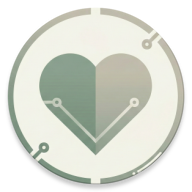

# Trusta

### Your Trusted Smart Health Assistant

A modern Android healthcare application that helps users manage medications, organize daily health routines, track physical activity, and receive AI-powered healthcare assistance.


</div>

---

# 📖 About Trusta

Trusta is a smart healthcare companion developed to simplify medication management and promote healthier daily habits.

The application combines medication reminders, daily planning, AI-powered health assistance, step tracking, reports, multilingual support, and customizable themes into one modern Android application.

Designed with **MVVM Architecture**, **Material Design 3**, and modern Android development practices, Trusta provides a responsive, scalable, and user-friendly healthcare experience.

---

# ✨ Features

## 🔐 Authentication

- Email Authentication
- Google Sign-In
- Secure User Sessions

---

## 💊 Medication Management

- Add Medications
- Medication Planner
- Daily Medication Schedule
- Smart Medication Reminders
- Alarm Management

---

## 🤖 Smart Features

- AI Health Assistant
- Smart Medication Search
- Daily Step Tracker
- Quick Access Actions

---

## 👤 User Experience

- User Profile
- Health Information
- Settings
- Light Theme
- Dark Theme
- System Theme
- English Language
- Arabic Language (RTL)

---

## ☁️ Cloud Features

- Firebase Authentication
- Cloud Firestore
- Offline Room Database

---

# 📱 Application Screenshots

## Welcome & Home

| Welcome | Home |
|---------|------|
| 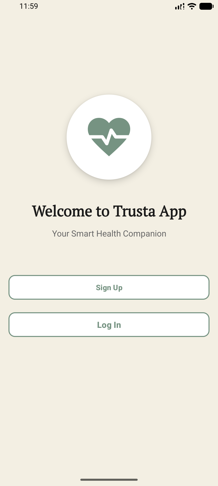 |  |

---

## Medication Management

| Medication Plan | Today's Schedule |
|-----------------|------------------|
| 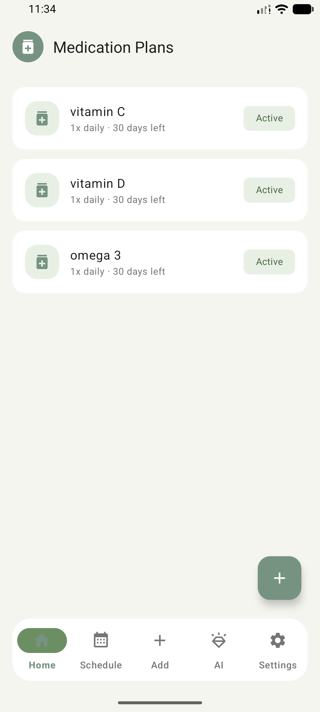 | 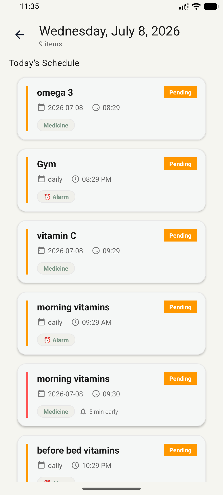 |

| Set Alarm | Alarm List |
|------------|------------|
| 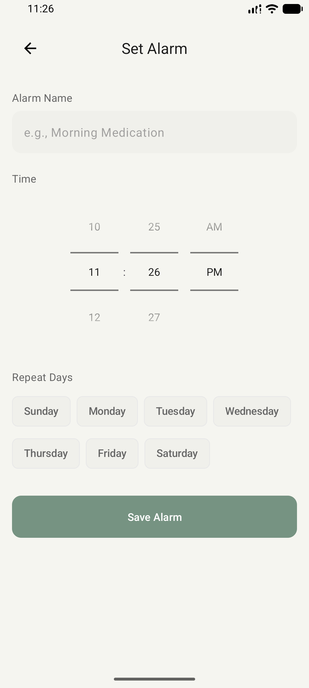 | 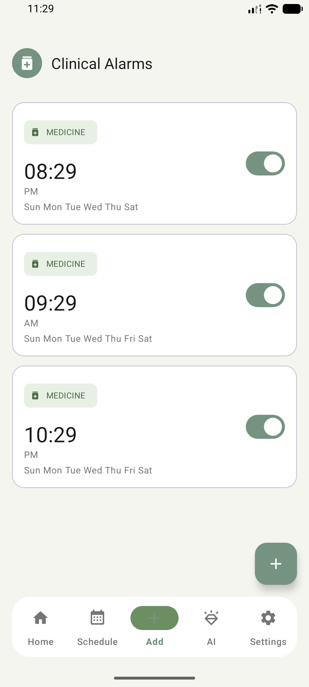 |

---

## Smart Features

| AI Assistant | Smart Search |
|--------------|--------------|
| 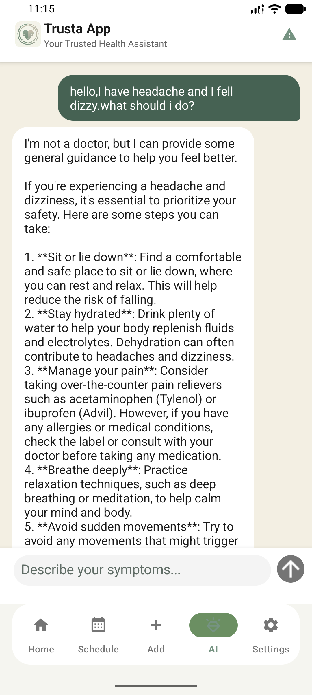 | 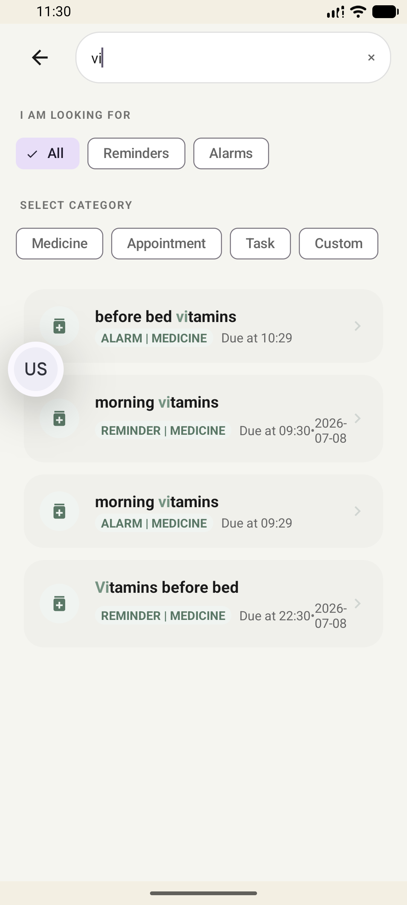 |

| Daily Steps | Quick Access |
|--------------|-------------|
| 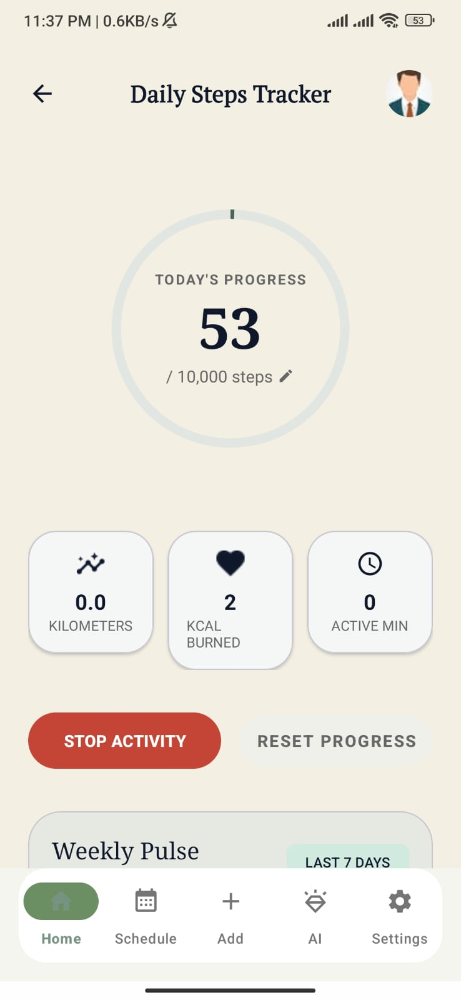 | 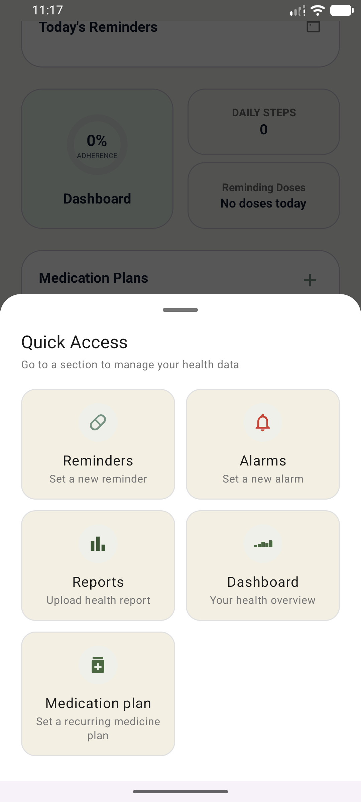 |

---

## User Experience

| Complete Profile | Settings |
|------------------|----------|
| 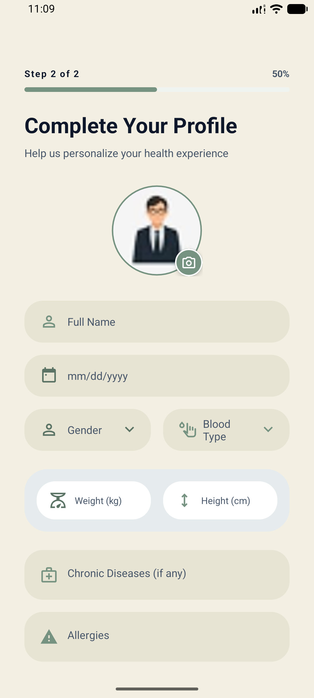 | 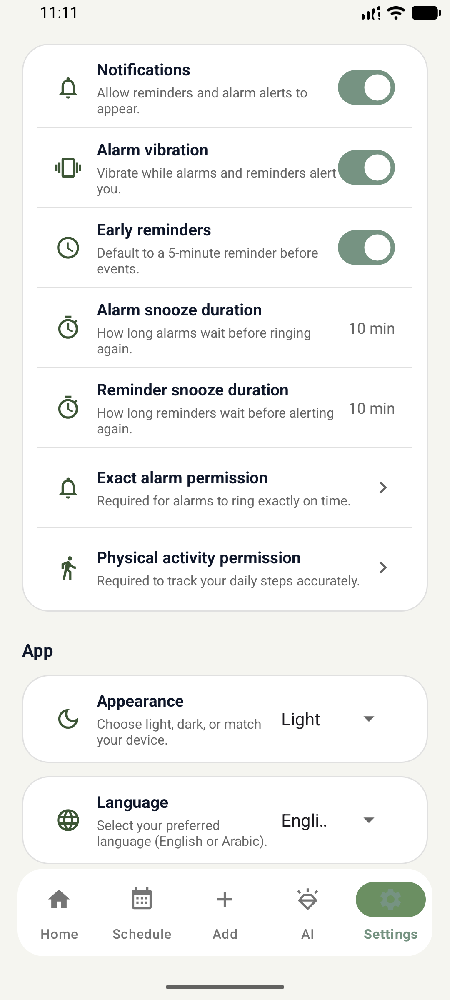 |

| Light Theme | Dark Theme |
|-------------|------------|
| 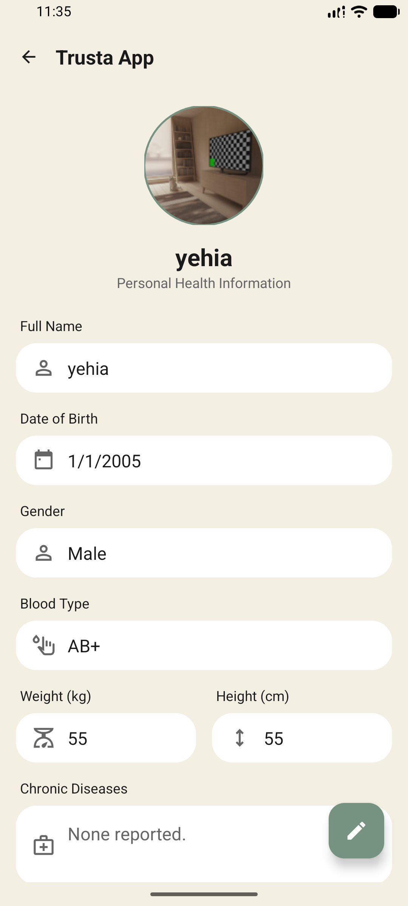 | 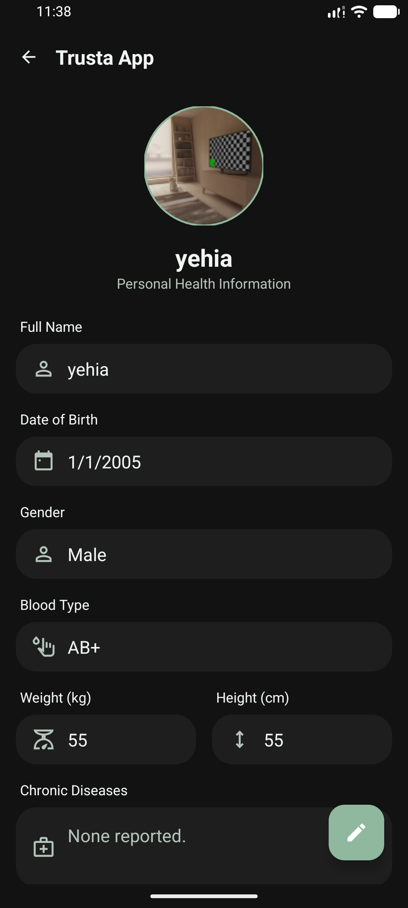 |

---

## Daily Planner

| Schedule |
|----------|
| 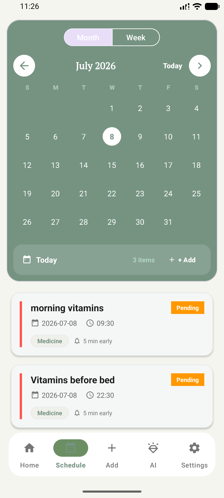 |

---

# 🏗 Architecture

The project follows the **MVVM (Model-View-ViewModel)** architecture.

```
                UI
                │
                ▼
          ViewModel
                │
                ▼
          Repository
       ┌────────┼────────┐
       ▼        ▼        ▼
    Room DB Firebase Retrofit
```

### Architecture Components

- View (Activities & Fragments)
- ViewModel
- Repository Pattern
- Room Database
- Firebase Authentication
- Cloud Firestore
- Retrofit
- Dependency Injection (Koin)

---

# 🛠 Tech Stack

### Language

- Kotlin

### UI

- XML
- Material Design 3

### Architecture

- MVVM
- Repository Pattern

### Dependency Injection

- Koin

### Local Database

- Room

### Cloud

- Firebase Authentication
- Cloud Firestore

### Networking

- Retrofit

### Asynchronous Programming

- Kotlin Coroutines
- Kotlin Flow

### Navigation

- Navigation Component

---

# 📂 Project Structure

```
app
│
├── core
├── data
│   ├── local
│   ├── remote
│   └── repository
│
├── features
│   ├── authentication
│   ├── home
│   ├── medication
│   ├── planner
│   ├── reminders
│   ├── reports
│   ├── ai
│   ├── profile
│   └── settings
│
├── di
├── utils
└── ui
```

---

# 🚀 Getting Started

Clone the repository

```bash
git clone https://github.com/MomenOsama123/SmartHealthReminder.git
```

Open the project using Android Studio.

Sync Gradle.

Run the application.

---

# 🎯 Future Improvements

- Medication Information API
- PDF Report Export
- Wear OS Support
- Cloud Backup & Restore
- Advanced Health Analytics
- AI Medication Recommendation
- Health Charts & Statistics

---

# 👨‍💻 Team

- **Mo'men Osama Galal**
- **Mohamed Ali Mohamed**
- **Yehia Naghe Abdelhmeed**
- **Rewan Mohamed Hafez**
- **Mona Mohamed Awad**

---

# ⭐ Support

If you like this project, don't forget to give it a ⭐ on GitHub.

---

<div align="center">

## Trusta

**Your Trusted Smart Health Assistant**

Made with ❤️ using Kotlin & Material Design 3

</div>
