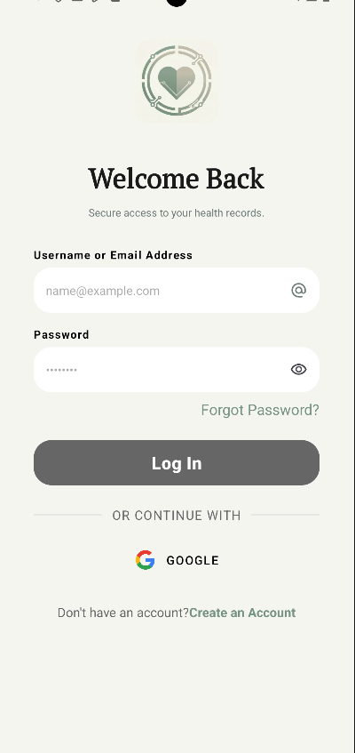
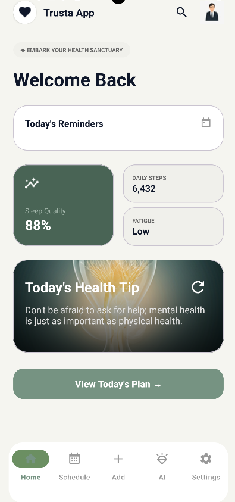
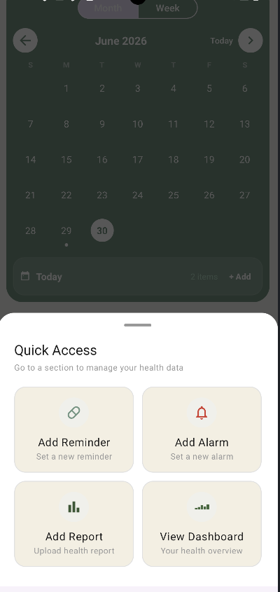
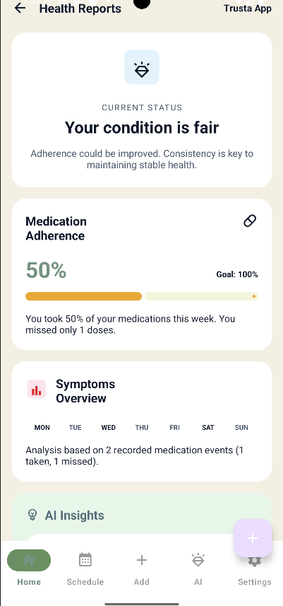

# 🩺 Trusta

> **Your Trusted Health Assistant**

Trusta is a modern Android healthcare application designed to help users manage medications, reminders, alarms, daily health activities, and wellness routines through a simple, intelligent, and user-friendly experience.

The application combines medication reminders, smart alarms, AI-powered assistance, reports, activity tracking, daily planning, and health insights into one centralized platform to encourage healthier habits and improve medication adherence.

---

# ✨ Features

## 🔐 Secure Authentication

- Email & Password Authentication
- Google Sign-In
- Password Recovery
- Firebase Authentication

---

## 💊 Medication Management

- Add Medication Reminders
- Edit & Delete Reminders
- View Reminder Details
- Recurring Reminders
- Reminder Status Tracking
- Today's Medications

---

## ⏰ Smart Alarm System

- Medication Alarms
- Enable / Disable Alarms
- Scheduled Notifications
- Smart Reminder Alerts

---

## 📊 Smart Dashboard

- Today's Overview
- Pending & Completed Statistics
- Quick Access Cards
- Daily Health Tips

---

## 🔍 Smart Search

- Instant Search
- Search History
- Reminder & Alarm Search
- Fast Filtering

---

## 🤖 AI Health Assistant

- AI-powered Health Guidance
- Medication Assistance
- Interactive Chat Experience

---

## 📅 Daily Planner

- Daily Schedule Management
- Calendar Notes
- Daily Tasks

---

## 📈 Reports

- Medication Reports
- Activity Statistics
- Health Progress Overview

---

## 🚶 Step Tracker

- Daily Step Counting
- Walking Progress
- Activity Monitoring
- Daily Goal Tracking

---

## 🌍 Multi-language Support

- English
- Arabic *(Currently expanding across the application)*

---

## 🎨 Personalization

- ☀️ Light Theme
- 🌙 Dark Theme
- ⚙️ System Theme

---

# 📱 Application Screenshots

| Login | Home |
|-------|------|
|  |  |

| Quick Access | Reports |
|-------------|---------|
|  |  |

> More screenshots will be added in future releases.

---

# 📥 Download

## Latest Release

### 🚀 Version **v0.9.3**

Download the latest APK from GitHub Releases:

➡️ **https://github.com/MomenOsama123/SmartHealthReminder/releases/tag/v0.9.3**

---

# 🏗️ Application Architecture

Trusta follows modern Android development principles to ensure scalability, maintainability, and performance.

## Architecture Pattern

- MVVM (Model–View–ViewModel)
- Repository Pattern

## Local Storage

- Room Database

## Cloud Services

- Firebase Authentication
- Firebase Firestore

## Networking

- Retrofit

## Dependency Injection

- Koin

## Asynchronous Programming

- Kotlin Coroutines
- Kotlin Flow

## User Interface

- XML Layouts
- Material Design 3
- ViewBinding
- Navigation Component

---

# 🛠 Technologies Used

- Kotlin
- Android SDK
- Firebase Authentication
- Firebase Firestore
- Room Database
- Retrofit
- Koin
- Kotlin Coroutines
- Kotlin Flow
- Material Design 3
- ViewBinding
- Navigation Component

---

# 🚀 Application Highlights

- Modern MVVM Architecture
- Clean Project Structure
- Offline & Online Data Management
- Smart Medication Management
- AI-powered Health Assistant
- Smart Search Experience
- Daily Planner
- Reports & Statistics
- Step Tracker
- Light / Dark / System Theme
- Multi-language Ready
- Material Design 3 UI

---

# 📌 Project Status

**Current Version:** `v0.9.3`

### Completed Features

- ✅ User Authentication
- ✅ Medication Reminder Management
- ✅ Alarm Management
- ✅ Smart Dashboard
- ✅ Smart Search
- ✅ AI Health Assistant
- ✅ Reports
- ✅ Daily Planner
- ✅ Calendar Notes
- ✅ Step Tracker
- ✅ Daily Health Tips
- ✅ Light / Dark / System Theme
- ✅ Arabic Localization *(In Progress)*

The application is currently in its final development stage and continues to receive improvements before the first stable release.

---

# 🔮 Future Improvements

- Complete Arabic Localization
- Medication Database API Integration
- Automatic Medication Schedule Generation
- PDF Report Export
- Health Progress Analytics
- Personalized AI Recommendations
- Wearable Device Integration

---

# 🎯 Project Goal

Trusta aims to simplify medication management and encourage healthier daily routines through smart reminders, intelligent assistance, activity tracking, and an intuitive Android experience.

Our goal is to provide users with a trusted healthcare companion that supports medication adherence and promotes healthier lifestyles.

---

# 🎓 About

**Trusta** was developed as a **Graduation Project** for the **Faculty of Computers and Data Science**.

The project combines modern Android technologies with healthcare-focused features to deliver an intelligent, practical, and user-centered mobile application.

---

# ⭐ Support the Project

If you like this project, consider giving it a ⭐ on GitHub.

---

# 📄 License

This project was developed for educational and graduation project purposes.
